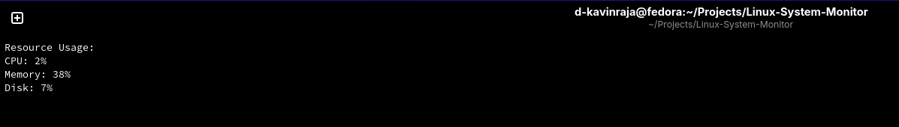

# Linux System Monitor

[](LICENSE)

A comprehensive, Bash-based real-time system monitor that tracks CPU, memory, disk, and network usage with colorized output, progress bars, and configurable thresholds.

## Features

- **Resource Monitoring**: Live CPU, memory, disk, and network usage display
- **Visual Progress Bars**: Easy-to-read progress bars for each resource
- **Configurable Thresholds**: Set custom alert thresholds via command-line options
- **Alert System**: Colorized alerts when thresholds are exceeded
- **Top Processes**: Shows the top 5 processes by CPU usage
- **System Information**: Displays hostname, OS, kernel, and uptime
- **Logging**: Optional file logging capability
- **Single-Run Mode**: One-time snapshot mode for scripting
- **No External Dependencies**: Uses only standard Linux utilities

## Prerequisites

- Bash (GNU bash)
- Common utilities: `top`, `free`, `df`, `ps`, `awk`, `tput`

## Installation

1. Clone or download the script:

```bash
wget https://raw.githubusercontent.com/d-kavinraja/Linux-System-Monitor/main/system_monitor.sh
```

2. Make it executable:

```bash
chmod +x system_monitor.sh
```

## Usage

### Basic Usage

Run the monitor with default settings:

```bash
./system_monitor.sh
```

### Command-Line Options

| Option | Description | Example |
|--------|-------------|---------|
| `-c, --cpu-threshold <n>` | Set CPU alert threshold | `-c 90` |
| `-m, --mem-threshold <n>` | Set memory alert threshold | `-m 85` |
| `-d, --disk-threshold <n>` | Set disk alert threshold | `-d 70` |
| `-i, --interval <n>` | Set refresh interval (seconds) | `-i 5` |
| `-l, --log <file>` | Enable logging to file | `-l /var/log/monitor.log` |
| `-s, --single` | Single run mode | `-s` |
| `-h, --help` | Show help message | `-h` |

### Examples

Monitor with custom thresholds:

```bash
./system_monitor.sh -c 90 -m 85 -d 70 -i 5
```

Single snapshot for scripting:

```bash
./system_monitor.sh -s
```

Enable logging:

```bash
./system_monitor.sh -l ~/system_monitor.log
```

### Keyboard Controls

- **Ctrl+C**: Stop the monitor

## Output Sections

1. **System Information**: Hostname, OS, kernel version, uptime, and thresholds
2. **Resource Usage**: Progress bars for CPU, memory, disk, and network
3. **Alerts**: Warnings when thresholds are exceeded
4. **Top Processes**: Top 5 CPU-consuming processes
5. **Status Bar**: Last update timestamp

    

## Configuration

Thresholds can be configured:

- **Via Command Line**: Use the `-c`, `-m`, `-d`, `-i` options
- **In Script**: Edit the variables at the top of `system_monitor.sh`:

```bash
CPU_THRESHOLD=80
MEMORY_THRESHOLD=80
DISK_THRESHOLD=80
REFRESH_INTERVAL=2
```

## Screenshots

### Normal Operation


### With Alerts
When thresholds are exceeded, alerts are displayed in red:

```
⚠ ALERT: CPU usage exceeded threshold! (85% >= 80%)
```

## Contributing

Contributions, issues, and feature requests are welcome!

## License

See the [LICENSE](LICENSE) file for license details.

## Acknowledgments

- Built with pure Bash for maximum compatibility
- Uses `/proc/stat` for CPU metrics
- Uses `free` for memory information
- Uses `df` for disk statistics
- Uses `/sys/class/net` for network statistics
